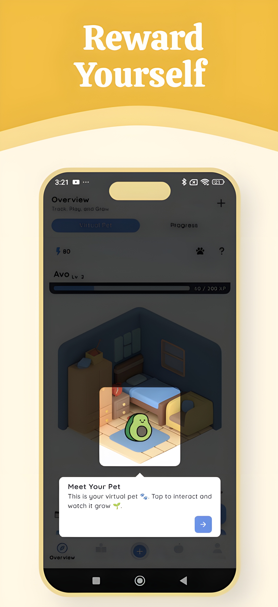
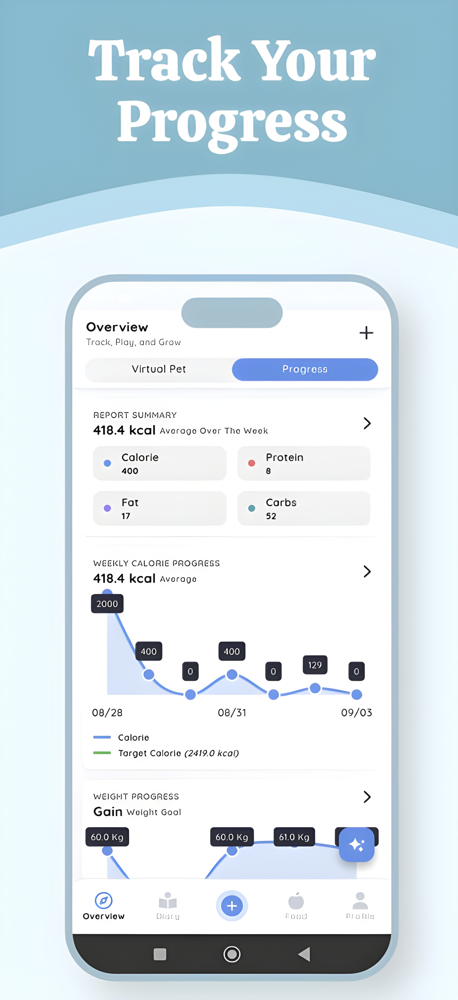
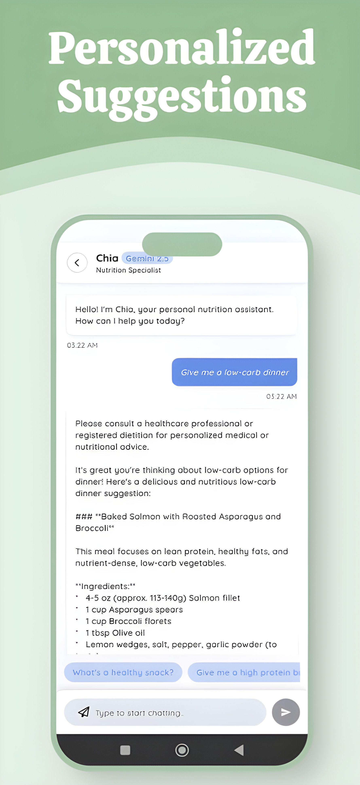

# 🥗 Flux — Smart Calorie Tracking App

Flux is a **smart and engaging calorie tracking app** that helps users understand their eating habits and stay on track with their nutrition goals.  
Using **advanced meal scanning technology**, Flux allows users to capture their meals with their camera or scan food barcodes to instantly estimate calorie and nutrient information.

Designed to make nutrition tracking **simple, interactive, and motivating**, Flux combines accurate food analysis with **gamified daily missions** and **progress tracking**, turning healthy eating into a rewarding experience.

---

| Meal Scan | Gamification | Progress Tracking | Chatbot |
|------|------------|-----------|---------------|
|  |  |  |  |

---

## 🚀 Features

### 🧠 Meal Scan
- Capture meals with your camera and detect foods instantly.  
- Get automatic calorie and nutrient estimates (protein, carbs, fats).

### 📷 Barcode Scanner
- Quickly log packaged foods by scanning their barcodes.  
- Fetch calorie and nutrient data from an integrated food database.

### 🍱 Manual Entry
- Add meals manually by selecting from the food database.  
- Input serving size and weight for accurate tracking.

### 🎯 Daily Calorie Missions
- Set daily calorie goals and earn rewards for completing them.  
- Stay consistent with motivating daily challenges.

### 📊 Progress Tracking
- View your calorie and nutrient trends over time.  
- Visualize progress with clear charts and summaries.

### 🕹️ Gamification
- Earn points for completing goals and unlock virtual pets or collectibles.  
- Make healthy eating fun and rewarding.

---

## 🧩 Tech Stack

- **Frontend:** Flutter (Dart)  
- **Backend:** Supabase
- **Database:** PostgreSQL
- **Authentication:** Supabase Auth
- **API Integration:** Nutritionix API
- **Image Recognition:** Gemini Developer API

---
